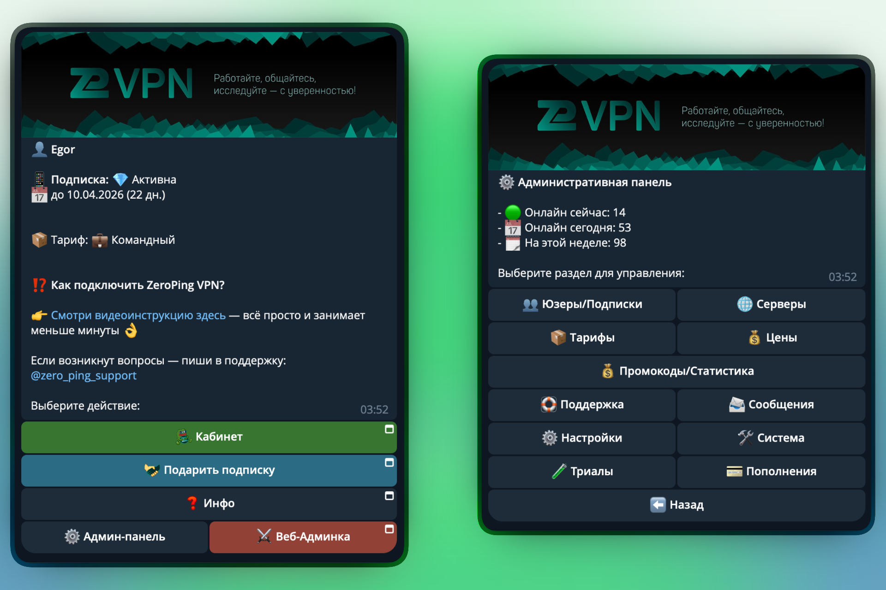
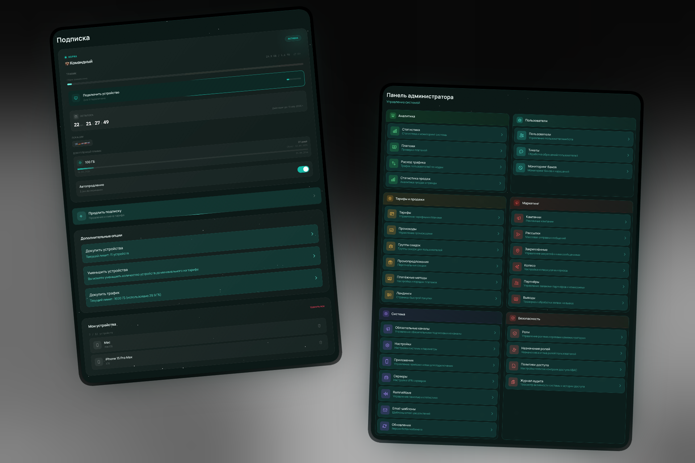

<div align="center">

# GorecBot

**Telegram-бот для автоматизации VPN-бизнеса на базе [Remnawave](https://github.com/remnawave/backend)**

Принимает оплату, выдаёт подписки, управляет пользователями — пока вы спите.

[](https://python.org)
[](https://postgresql.org)
[](https://www.docker.com/)
[](LICENSE)

</div>

---

## 🧩 Что такое GorecBot?

GorecBot — полнофункциональная платформа для продажи VPN-подписок через Telegram. Бот интегрируется с панелью [Remnawave](https://github.com/remnawave/backend) и берёт на себя весь цикл: от регистрации пользователя до автопродления подписки.

> 🖥 **[GorecBot Cabinet](https://github.com/gorecvpn/Gorec-Cabinet)** — веб-кабинет на React + TypeScript, который существенно расширяет возможности бота: личный кабинет, OAuth-авторизация (Google, Yandex, Discord, VK, Telegram OIDC), лендинги, аналитика продаж, RBAC и подарочные подписки.

<div align="center">



</div>

---

## ✨ Возможности

<table>
<tr>
<td width="50%" valign="top">

### 📦 Подписки и тарифы

- 🎯 Гибкие тарифные планы (от X дней до X дней)
- 📊 Трафик: безлимит, фиксированный лимит или пакеты с возможностью докупки
- 📱 Управление устройствами (1–20 на подписку) или отключение лимитов
- 🌍 Автовыбор сервера(Тарифы) или ручной выбор(Конфигуратор подписки - с возможностью докупки)
- 🆓 Пробный период(Возможен платный) с конвертацией в платный
- 🛒 Умная корзина — сохраняет выбор при недостатке баланса
- 🔄 Автопродление за 3 дня до окончания
- 🎁 Подарочные подписки (нативно в Telegram-боте и веб-кабинете) с генерацией deep-link ссылок и передачей через Telegram Share

</td>
<td width="50%" valign="top">

### 💳 Платежи

- 🏦 **27 платёжных провайдеров** одновременно
- 💰 Единый баланс: пополнение любым способом → покупка с баланса
- ⚡ Автопокупка подписки после пополнения
- 💾 Рекуррентные платежи (сохранённые карты)
- 🧾 Фискализация через НалоGo (для самозанятых)
- 🔍 Автопроверка статуса платежей
- 🛍 Гостевые покупки через лендинги

</td>
</tr>
<tr>
<td width="50%" valign="top">

### 📣 Маркетинг и продвижение

- 🏷 Промокоды (деньги, дни подписки, триалы)
- 👥 Реферальная программа с выводом средств
- 👥 Партнерская система
- 📨 Рассылки по сегментам пользователей
- 🌐 Кастомные лендинги с аналитикой
- 🎮 Конкурсы и ежедневные игры с призами
- 🎯 Персональные предложения и скидки
- 📈 Маркетинговые кампании с трекингом
- 🌐 Обязательная мультиподписка на каналы с возможностью автоотключения подписки - при отписки от канала

</td>
<td width="50%" valign="top">

### 🛠 Администрирование

- 🤖 Панель управления прямо в Telegram
- 👤 Управление пользователями, подписками, платежами
- 📬 Уведомления в топики: покупки, продления, пополнения
- 💾 Автобэкапы БД с восстановлением из бота
- 🚧 Режим техработ (авто-детект недоступности панели)
- 📡 Мониторинг трафика и аномалий
- 🤝 Партнёрская программа
- 🔐 RBAC: роли и гранулярные права доступа
- 📈 Детальная отчетность с возможностью визуализации Реф сети
- 🔐 Блокировка юзеров из общего черного списка
И многое др...

</td>
</tr>
</table>

---

## 🎁 Подарочные подписки (Subscription Gifting)

GorecBot поддерживает полный кросс-канальный жизненный цикл покупки, управления и активации подарочных подписок как нативно в Telegram-боте, так и через веб-кабинет [GorecBot Cabinet](https://github.com/gorecvpn/Gorec-Cabinet).

### 🔑 Канонический формат кода и идентификация

- **Канонический публичный код**: `GIFT_<59_символов>` (например, `GIFT_7b8a1c9...`). Формат специально оптимизирован под ограничение длины deep-link параметров Telegram (`/start GIFT_<59>`).
- **Единая сущность `GuestPurchase`**: Подарок хранится в единой таблице гостевых покупок с 64-символьным токеном. Никаких дополнительных таблиц или миграций базы данных не требуется — канонический код и ссылки детерминированно выводятся из токена.
- **Конфиденциальность**: Полные токены, фрагменты токенов и публичные коды никогда не передаются в callback data, логах, описаниях транзакций или сообщениях об ошибках.

### 📲 Способы активации подарка

1. **Telegram Deep-Link**: Ссылка вида `https://t.me/<bot_username>?start=GIFT_<59_символов>`. При переходе бот сразу регистрирует нового пользователя (или приветствует существующего) и активирует подарочную подписку.
2. **Ручной ввод в Telegram-боте**: Кнопка **«🎁 Подарки» → «Ввести код»**. Принимает канонический код `GIFT_<59>`, исходный 64-значный токен, deep-link ссылку Telegram или URL веб-кабинета. При вводе недействительного кода бот сохраняет состояние для повторной попытки.
3. **Активация в Web Cabinet**: Эндпоинт `/gift/activate` и форма в личном кабинете. Поддерживает канонические коды `GIFT_<59>`, ссылки deep-link/веб-кабинета, а также устаревшие форматы (8/12-символьные префиксы и `GIFT-<12>`).
4. **Прямая веб-ссылка**: `https://<cabinet_url>/buy/gift/<64_символа>` — интерфейс гостевой или авторизованной активации в веб-кабинете.

### 📜 Раздел «Мои подарки» (History & Recovery)

- **Восстановление и шаринг**: В Telegram-боте в меню подписок доступен раздел **«🎁 Мои подарки»**. Покупатель в любой момент может открыть купленный подарок, скопировать канонический код `<code>GIFT_<59></code>`, открыть deep-link или переслать подарок через кнопку Telegram Share (`t.me/share/url`). Восстановление работает даже после очистки FSM-контекста или перезапуска бота без повторных списаний баланса.
- **Единый вид карточки (Source-neutral)**: Подарки, купленные в боте или в веб-кабинете, отображаются в боте идентично — без указания канала покупки, способов оплаты или цены.
- **Статус доставки**: После активации получателем статус подарка меняется на **«Активирован»**, отображается имя получателя (`@username` или email) и дата активации, а кнопки передачи и код скрываются.

### ⚙️ Правила и бизнес-логика для операторов

- **Включение функционала**: Установите `CABINET_GIFT_ENABLED=true` (через `SystemSetting` в БД или админ-панели / `.env`). Флаг управляет каталогом подарков одновременно в боте и веб-кабинете.
- **Настройка тарифов**: Отметьте тарифы, доступные для дарения, флагом `show_in_gift = true` (`SHOW_IN_GIFT`).
- **Синхронизация ссылок**: Настройте `BOT_USERNAME` (username Telegram-бота) и `CABINET_URL` (URL веб-кабинета).
- **Оплата подарков**: В боте подарок оплачивается с внутреннего баланса. При нехватке средств бот предлагает пополнение через любой шлюз с сохранением корзины. В кабинете доступна оплата как с баланса, так и через платёжные шлюзы (YooKassa, CryptoBot, Stars и др.).
- **Запрет самоактивации (Self-claim prohibition)**: Покупатель не может активировать свой собственный подарок ни в боте, ни в кабинете.
- **Право первого заявителя (First-claim ownership)**: Подарок закрепляется за первым активировавшим его пользователем. Попытки активации другими пользователями отклоняются (в кабинете возвращается 404 для защиты от подбора).
- **Идемпотентность**: Повторный ввод кода тем же самым получателем возвращает успешную карточку активации без повторного начисления подписки.
- **Бессрочность хранения**: Оплаченные подарки не сгорают и не имеют срока давности.
- **Управление продажами vs. право на получение**: При отключении `CABINET_GIFT_ENABLED=false` каталог покупки подарков скрывается, но все ранее оплаченные подарки остаются доступны в разделе «Мои подарки» и могут быть активированы получателями.

### 🌐 Cabinet API & Frontend Boundary

Бэкенд предоставляет и тестирует полный контракт API для подарочных подписок:
- **Канонические поля**: `gift_code` (публичный код `GIFT_<59_chars>`), `bot_claim_url` (`https://t.me/<bot>?start=GIFT_<59_chars>`) и `cabinet_claim_url` (`https://<cabinet>/buy/gift/<64_chars>`) возвращаются в ответах `/gift/purchase`, `/gift/purchase/{token}`, `/gift/sent` и `/landing/purchase/{token}`, `/landing/gift/{token}` для всех активных (`PAID` / `PENDING_ACTIVATION`) подарков. Для доставленных подарков (`DELIVERED`) поля действий сбрасываются в `None`, сохраняя историю.
- **Обратная совместимость**: Устаревшие поля (`purchase_token`, `token`, `claim_url`, `bot_claim_link`) сохраняются без изменений. Эндпоинт активации `/gift/activate` продолжает принимать короткие 8/12-символьные коды, префиксы `GIFT-`, канонические `GIFT_...` коды и URL-ссылки.
- **Граница внешнего фронтенда**: Этот репозиторий содержит бэкенд и тесты контракта API. Внешний веб-кабинет ([GorecBot Cabinet](https://github.com/gorecvpn/Gorec-Cabinet)) разрабатывается в отдельном репозитории и должен отображать новые канонические поля `gift_code`, `bot_claim_url` и `cabinet_claim_url` для визуального паритета с ботом.

---

## 💳 Платёжные провайдеры

<div align="center">

| | Провайдер | Методы оплаты | Валюта |
|:---:|:---|:---|:---:|
| ⭐ | **Telegram Stars** | Звёзды Telegram | XTR |
| 🏦 | **YooKassa** | Карты, СБП | RUB |
| 🏦 | **YooKassa СБП** | Система быстрых платежей | RUB |
| 🪙 | **CryptoBot** | USDT, TON, BTC, ETH | Crypto |
| 🪙 | **Heleket** | USDT, мульти-сеть | Crypto |
| 💳 | **CloudPayments** | Карты, 3D-Secure | RUB |
| 💳 | **Freekassa** | NSPK СБП, карты | RUB |
| 💳 | **Kassa AI** | СБП, карты, SberPay | RUB |
| 💳 | **PayPalych (Pal24)** | Карты, СБП | RUB |
| 🤝 | **[Platega](https://t.me/ArstanPlatega)** | Карты, СБП, крипто | RUB |
| 💳 | **WATA** | СБП, Карты | RUB |
| 💳 | **MulenPay** | Карты | RUB |
| 💳 | **RioPay** | Карты | RUB |
| 💳 | **SeverPay** | СБП, карты | RUB |
| 🤝 | **[PayPear](https://t.me/Paymen1_Manager)** | Карты, СБП, SberPay, T-Pay | RUB |
| 🤝 | **[RollyPay](https://rollypay.io/)** | СБП, карты, крипто | RUB → USDT |
| 🤝 | **[AuraPay](https://aurapay.tech/)** | Карты, СБП | RUB |
| 🤝 | **[Overpay](https://overpay.pro/)** | Карты, СБП | RUB |
| 🦌 | **Antilopay** | Карты, СБП, SberPay (RSA подпись) | RUB |
| 💳 | **Etoplatezhi** | Карты, СБП | RUB |
| 🪐 | **[Jupiter](https://t.me/k_juppiter)** | СБП через QR (FPGate P2P v2.1) | RUB |
| 🍩 | **[Donut](https://t.me/donut_payment)** | Карты, СБП по телефону, СБП QR (P2P) | RUB |
| 🌋 | **Lava Business** | Карты, СБП (gate.lava.ru) | RUB |
| 💳 | **CisPay** | СБП, карты (api.cispay.app) | RUB |
| 💳 | **TabPay** | СБП, карты с 3-D Secure (tabpay.org) | RUB |
| 💳 | **ParityPay** | СБП, карты (api.paritypay.net) | RUB |
| 🍎 | **Apple In-App Purchase** | Покупки через iOS App Store | USD |
| 📲 | **Tribute** | Telegram-платежи | RUB |

</div>

## 🚀 Быстрый старт

```bash
git clone https://github.com/gorecvpn/Gorec.git
cd Gorec
cp .env.example .env   # заполните переменные
docker compose up -d
```


---

## 🏗 Стек

| | Компонент | Технология |
|:---:|:---|:---|
| 🐍 | Язык | Python 3.13, полностью async |
| 🤖 | Telegram | aiogram 3.x |
| 🗄 | База данных | PostgreSQL + SQLAlchemy 2.x + Alembic |
| 🔴 | Кэш/очереди | Redis |
| ⚡ | Web-сервер | FastAPI (webhook, платежи, Cabinet API) |
| 📝 | Логирование | structlog |
| 🐳 | Контейнеризация | Docker + Docker Compose |
| 🧹 | Линтер | ruff |

---

## 🖥 GorecBot Cabinet

<div align="center">

[](https://github.com/gorecvpn/Gorec-Cabinet)

<br>



</div>

Веб-кабинет на **React + TypeScript**, существенно расширяющий возможности бота:

| | Возможность | Описание |
|:---:|:---|:---|
| 👤 | **Личный кабинет** | Подписки, баланс, устройства, реферальная программа |
| 🔑 | **OAuth-авторизация** | Google, Yandex, Discord, VK, Telegram OIDC |
| 🌐 | **Лендинги** | Кастомные страницы для привлечения клиентов |
| 📊 | **Админ-панель** | Аналитика продаж, RBAC, управление контентом |
| 🎁 | **Подарки** | Покупка и отправка подписок другим пользователям |
| 🔍 | **Поиск платежей** | Поиск по инвойсу, клиенту с фильтрами и статистикой |


---

<div align="center">

**[MIT License](LICENSE)** — используйте свободно для личных и коммерческих проектов.

</div>

